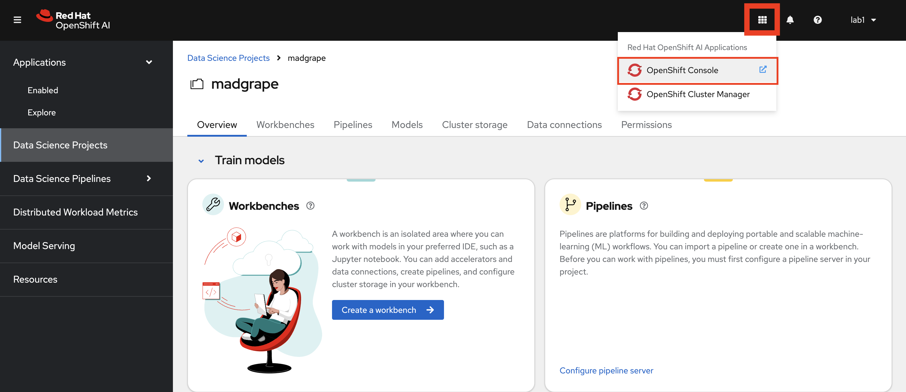
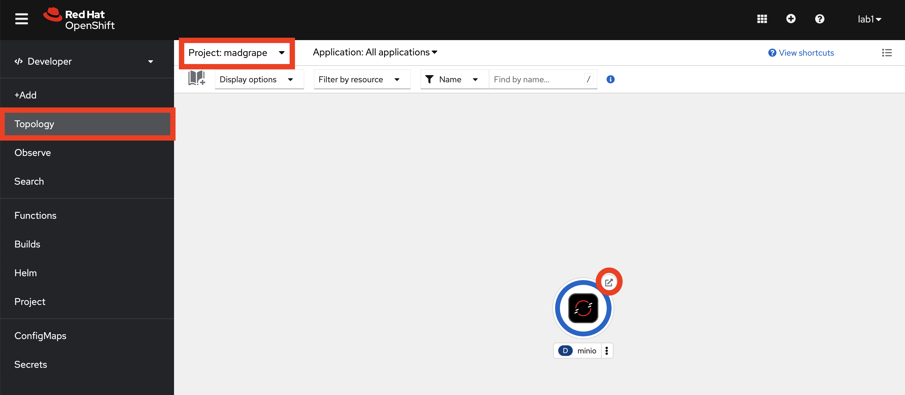
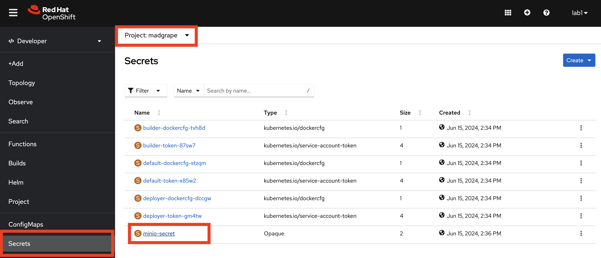
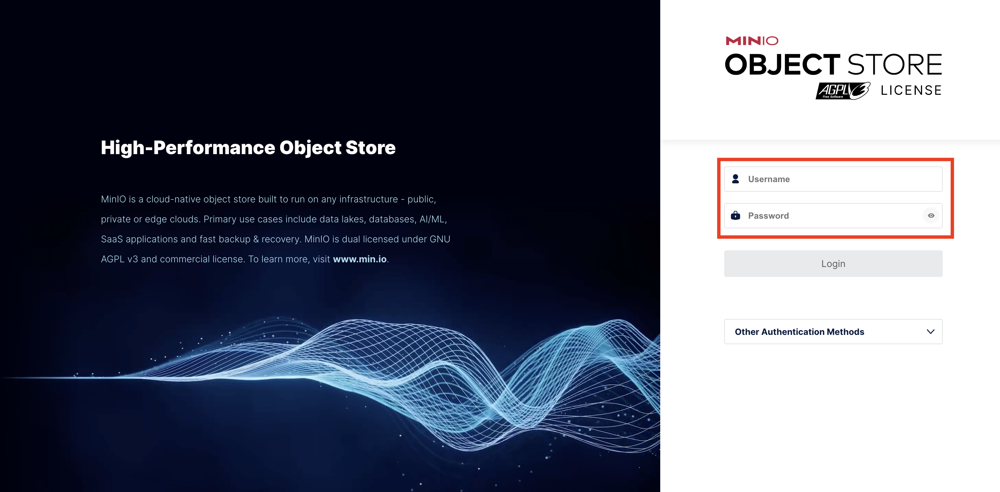
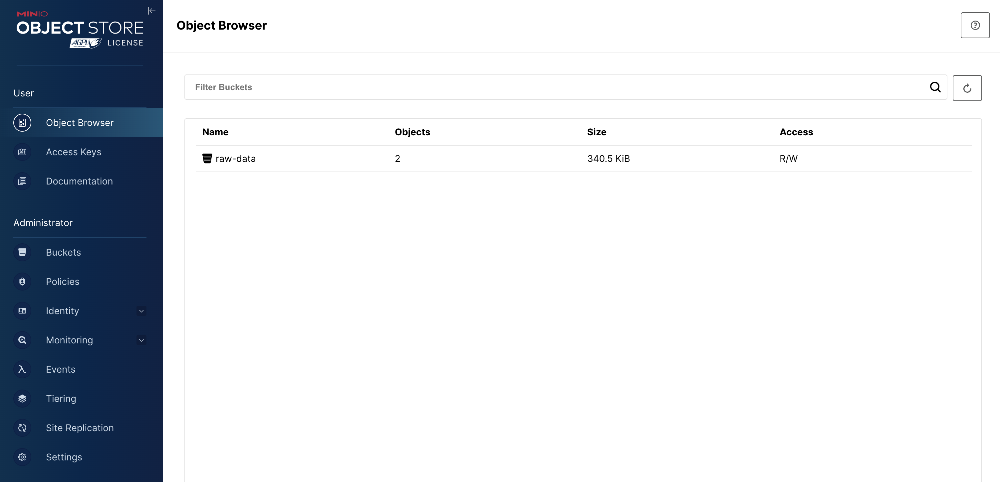
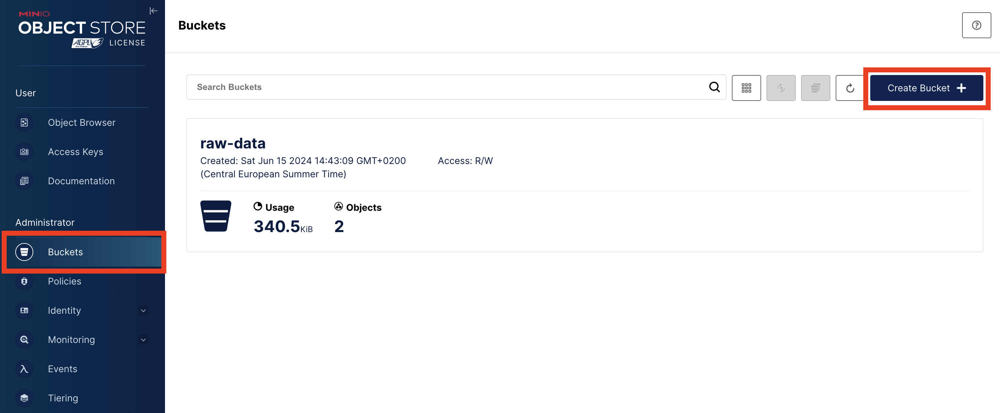

## Object Storage

Object storage provides a flexible and scalable way to store large amounts of unstructured data efficiently, making it a popular choice for cloud storage, content distribution, and for our usecase as well! We will use object storage to store our datasets and model artifacts.

### Setup an Object Storage

> Minio is one of the most popular object storage out there. It is tailored for cloud-native setups so it is fairly quick to spin up an instance for experimentations. It is also compatible with Amazon S3 API, accessible via a RESTful HTTP API, making integration with cloud-native applications and automation pretty straightforward.


1. This time we will go to OpenShift Console to install Minio. Click the square on the upper left corner close to your username and then click `OpenShift Console`. 



It should take you to the OpenShift Developer view where you can see the Data Science Project you just created.


2. Click `+` sign on the upper left corner and paste the below yaml file to the editor in the page. Then hit `Create`


```yaml
---
kind: PersistentVolumeClaim
apiVersion: v1
metadata:
  name: minio-pvc
  namespace: <TEAM_NAME>
spec:
  accessModes:
    - ReadWriteOnce
  resources:
    requests:
      storage: 20Gi
  volumeMode: Filesystem
---
kind: Secret
apiVersion: v1
metadata:
  name: minio-secret
  namespace: <TEAM_NAME>
stringData:
  minio_root_user: minio
  minio_root_password: IJrixDGbADAkgey5
---
kind: Deployment
apiVersion: apps/v1
metadata:
  name: minio
  namespace: <TEAM_NAME>
spec:
  replicas: 1
  selector:
    matchLabels:
      app: minio
  template:
    metadata:
      labels:
        app: minio
    spec:
      volumes:
        - name: data
          persistentVolumeClaim:
            claimName: minio-pvc
      containers:
        - resources:
            limits:
              cpu: 250m
              memory: 1Gi
            requests:
              cpu: 20m
              memory: 100Mi
          readinessProbe:
            tcpSocket:
              port: 9000
            initialDelaySeconds: 5
            timeoutSeconds: 1
            periodSeconds: 5
            successThreshold: 1
            failureThreshold: 3
          terminationMessagePath: /dev/termination-log
          name: minio
          livenessProbe:
            tcpSocket:
              port: 9000
            initialDelaySeconds: 30
            timeoutSeconds: 1
            periodSeconds: 5
            successThreshold: 1
            failureThreshold: 3
          env:
            - name: MINIO_ROOT_USER
              valueFrom:
                secretKeyRef:
                  name: minio-secret
                  key: minio_root_user
            - name: MINIO_ROOT_PASSWORD
              valueFrom:
                secretKeyRef:
                  name: minio-secret
                  key: minio_root_password
          ports:
            - containerPort: 9000
              protocol: TCP
            - containerPort: 9090
              protocol: TCP
          imagePullPolicy: IfNotPresent
          volumeMounts:
            - name: data
              mountPath: /data
              subPath: minio
          terminationMessagePolicy: File
          image: >-
            quay.io/minio/minio:RELEASE.2023-06-19T19-52-50Z
          args:
            - server
            - /data
            - --console-address
            - :9090
      restartPolicy: Always
      terminationGracePeriodSeconds: 30
      dnsPolicy: ClusterFirst
      securityContext: {}
      schedulerName: default-scheduler
  strategy:
    type: Recreate
  revisionHistoryLimit: 10
  progressDeadlineSeconds: 600
---
kind: Service
apiVersion: v1
metadata:
  name: minio-service
  namespace: <TEAM_NAME>
spec:
  ipFamilies:
    - IPv4
  ports:
    - name: api
      protocol: TCP
      port: 9000
      targetPort: 9000
    - name: ui
      protocol: TCP
      port: 9090
      targetPort: 9090
  internalTrafficPolicy: Cluster
  type: ClusterIP
  ipFamilyPolicy: SingleStack
  sessionAffinity: None
  selector:
    app: minio
---
kind: Route
apiVersion: route.openshift.io/v1
metadata:
  name: minio-ui
  namespace: <TEAM_NAME>
spec:
  to:
    kind: Service
    name: minio-service
    weight: 100
  port:
    targetPort: ui
  wildcardPolicy: None
  tls:
    termination: edge
    insecureEdgeTerminationPolicy: Redirect
```

3. This screen tells you that you created all the necessary objects to run a Minio storage instance in your environment successfully for your experimentation! Now let's go and configure Minio for our needs. 


4. Let's go to `Topology` view and click the little arrow on the screen. It will take you Minio UI. 




We'll need some credentials to log in Minio. The credentials are saved as a `Secret` object on OpenShift and we can get them from the UI. Click on `Secrets` from the left menu and select `minio-secret`. 

Make sure you already selected your Data Science Project `<TEAM_NAME>` on the Project dropdown list. 



Scroll down and you'll have `minio_root_user` and `minio_root_password` there which we are going to use for login. You can copy them one by one and paste them into the Minio UI. 


5. Now let's go back to the Minio UI and use these credentials to log in.



6. After you login, you'll see we already prepared a bucket for you that is holding the raw data we will be using while building our model. But we probably need another bucket to store the data we modified / transformed / encriched and so on, as well as the model we develop 🤓



7. Go to Buckets on the left and select `Create Bucket`.



8. Enter `wine-quality` as the bucket name and hit `Create`


<!-- In here we can either guide people to create Access Keys or let them use the root username / password. -->

 🪄🪄🪄 Now that we have our storage layer ready, let's create our development environment. 🪄🪄🪄