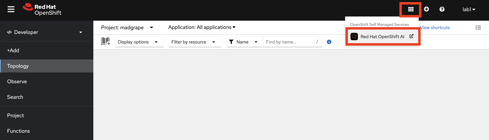
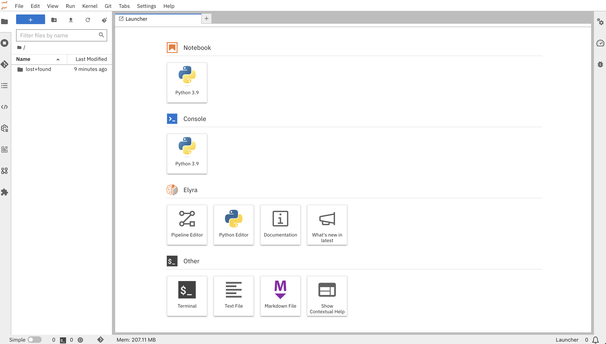

## Notebook Setup

1. Go back to OpenShift AI. You can do this by either the provided link or you can just click the square on the upper left and click `Red Hat OpenShift AI` 

Go to `Data Science Projects` and click your project `<TEAM_NAME>`.

2. Click `Create a Workbench` to create our Jupyter Notebook environment. OpenShift AI UI is pretty intiutive, isn't it? :)

3. Select a name you want, could be something like `winequality-nb` 🍷

For Notebook Image: 

- Image selection: `Standard Data Science`

- Version selection: `2024.1`

<!-- TODO: update this with the custom image. -->

Leave Deployment size as `Small` and Cluster storage as `20 GB`. The `Data connections` is the part where we will provide our Minio configuration. So check `Use a data connection` box and fill out the informaiton as below:

- Name: `minio`
- Access key: _copy from the credentials you saved previous_
- Secret key: _copy from the credentials you saved previous_
- Endpoint: `http://minio-service.<TEAM_NAME>.svc.cluster.local:9000`
- Region: `eu-central-1`
- Bucket: `wine-quality` 

_This credentials will be stored as a `Secret` object in your project and will be exposed to your Notebook environment. Then we will use them to interract with the bucket to read or write during our ML workflow._

And finally, hit `Create`.

4. When it is in the running stage, just click `Open` and it will redirect you to the Jupyter Notebook UI. You need to use your credentials again to log in. If you see the below screen, click `Allow selected permissions`. That will redirect you to your Jupyter Notebook.

And now, your working environment is ready to get your hands dirty with some data!💥💪

And to start, we need to setup our Git repository where we will save all our work. TODO: explain why using Git etc...