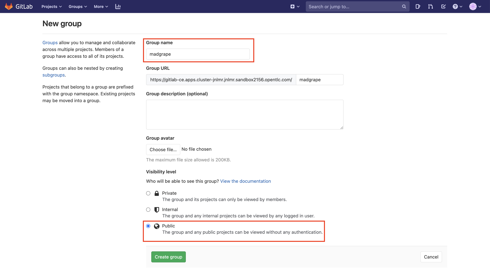
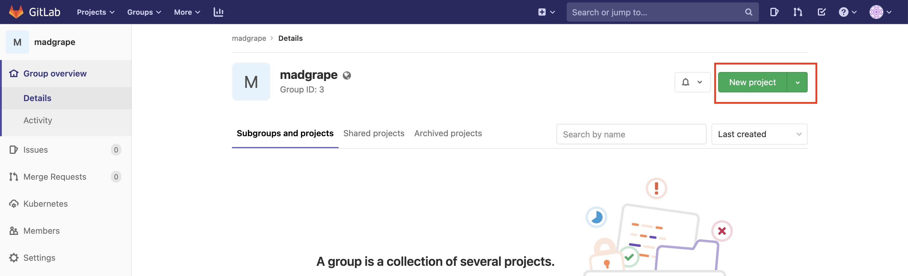
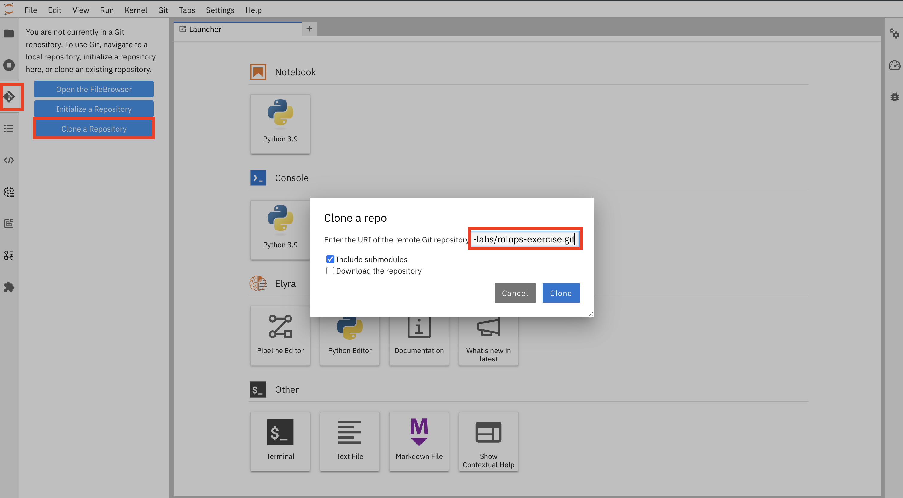

## Setup GitLab


> In this exercise we’ll setup our git project to store our code and configuration. We will then connect Argo CD (our GitOps controller) to this git repository to enable the GitOps workflow.


1. Log into GitLab with your credentials. GitLab URL [here](https://<GIT_SERVER>):

    ```bash
    https://<GIT_SERVER>
    ```

    We need to create a group in GitLab as `<TEAM_NAME>`.  Click "Create a group" on the screen:
    

2. Put your TEAM_NAME (<TEAM_NAME>>) as the group name, select Public for Visibility level, and hit Create group. This is so we can easily share code and view other teams’ activity.

    

3. Now lets create the git repository that we are going to use to store out Notebooks but also for GITOps purposes. The `mlops-exercise` will serve as a mono-repo holding both our tooling configuration and the application definitions and some other stuff. In the real world, you may want to separate these into different repos! Anyways, hit `New project` button on the right hand side
    

4. On the new view, use `mlops-exercise` as Project Name, select **Internal** for Visibility level, then hit Create project. Make sure the project is in the group you created previously and not the username's.
    

5. Now let's go back to Jupyter Notebook. Clone the original repository and push it into your new GitLab project. Click the Git icon from the left menu, then select `Clone a Repository`. Copy the GitHub link and clone the repository.

    ```bash
    https://github.com/rht-labs/mlops-exercise.git
    ```

    

6. On the Launcher page, click `Terminal` at the bottom left and run below commands to push our code to the GitLab server.

    🧐 TODO: turn this into a small python code maybe? or push from UI?

    First, we are going to create a Gitlab Personal Access Token (PAT). The token is a more secure and reliable method for accessing Gitlab from our scripts later on. Note, that for reference’s sake, you can also generate a PAT in Gitlab under User > Settings > Access Tokens in the Web UI. We use a helper script here to help automate that process. To generate the token, open a terminal if you have not got one open and run the following commands.
    
    Export GitLab server URL:

    ```bash
    export GIT_SERVER=<GIT_SERVER>
    ```

    Export your Gitlab username.

    ```bash
    export GITLAB_USER=<YOUR_GITLAB_USER>
    ```

    Export your Gitlab password.

    ```bash
    export GITLAB_PASSWORD=<YOUR_GITLAB_PASSWORD>
    ```

    <p class="tip">
    ⛷️ <b>TIP</b> ⛷️ - If your password includes special characters, try putting it in single quotes. ie: <strong>'A8y?Rpm!9+A3B/KG'</strong>
    </p>

    Generate your Gitlab PAT.

    ```bash
    gitlab_pat
    ```

    Echo the `GITLAB_PAT` environment variable.

    ```bash
    echo $GITLAB_PAT
    ```
    
    <!-- ..and lets persist it for now:
    ```bash
    echo "export GITLAB_PAT=${GITLAB_PAT}"  | tee -a ~/.bashrc -a ~/.zshrc
    ``` -->

    We can see the PAT printed out on the command line, it is also stored in an environment variable called `GITLAB_PAT`

    

7. Let's push our code to the GitLab server.

    ```bash
    cd mlops-exercise
    git remote set-url origin https://<GIT_SERVER>/<TEAM_NAME>/mlops-exercise.git
    ```

    Use the `GITLAB_PAT` from above when you are prompted for the password (this will be cached)

    ```bash
    git push -u origin --all
    ```

    With our git project created and our configuration pushed to it - let's start our GitOps Journey 🧙‍♀️🦄!

    <p class="tip">
    ⛷️ <b>TIP</b> ⛷️ - If your credentials are cached incorrectly, you can try clearing the cache using: <strong>git credential-cache exit</strong>
    </p> 