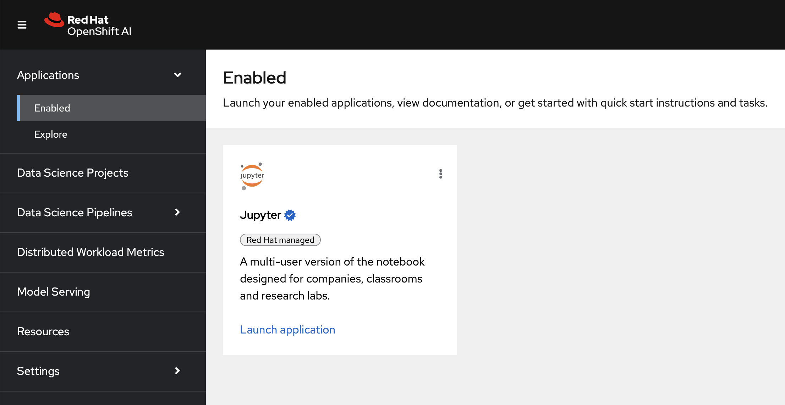
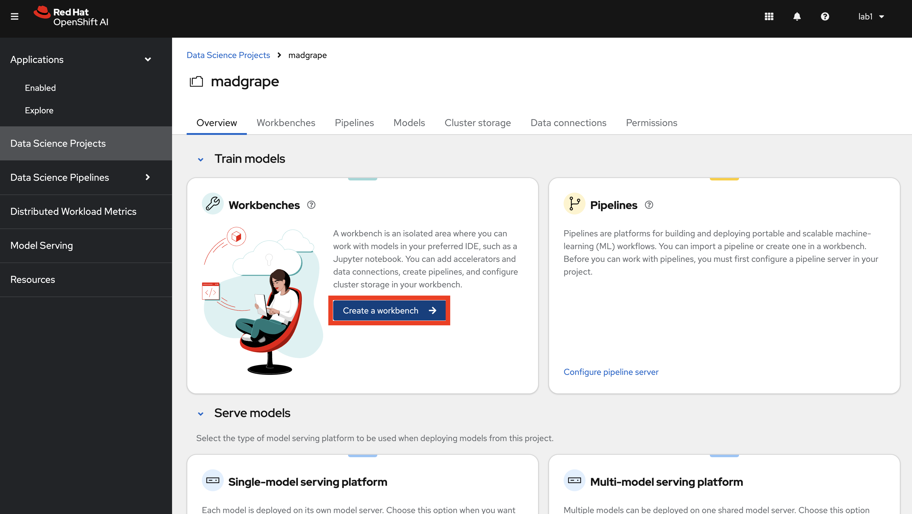
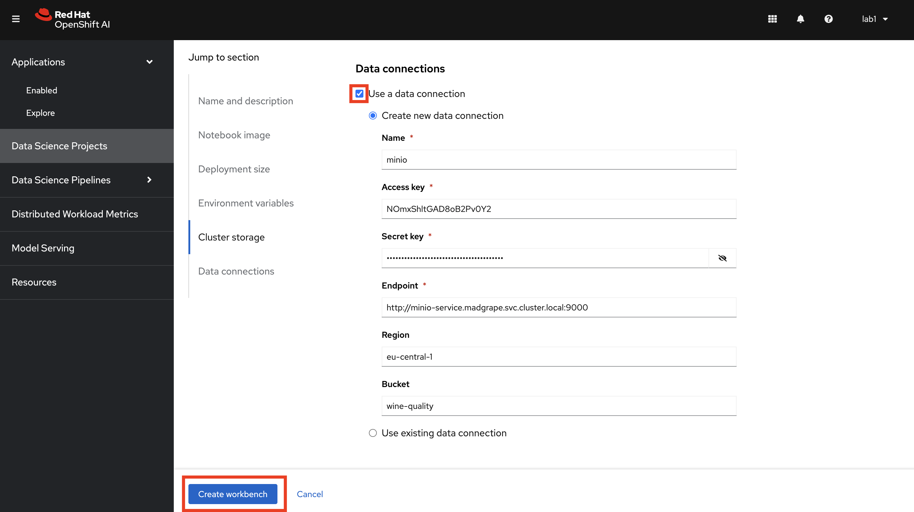
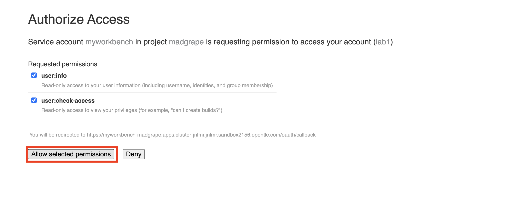

## Data Science Project

1. Login to OpenShift AI. The link and the credentials will be provided by your instructor.

    

2. You should be able to see a `Data Science Project` has already created for you. 

    This project will be the place where we create our Jupyter Notebook environment, train our model and deploy our model. Let's first check what is already baked for us here 🥔

    TODO: add screenshots from Data Connections and explanation.

3. Let's create a notebook. Click `Create a Workbench`. OpenShift AI UI is pretty intiutive, isn't it? :)

    TODO: update screenshots

    

3. Select a name you want, could be something like `hitmusic-nb` 🍷

    For Notebook Image: 

    - Image selection: `Standard Data Science`

    - Version selection: `2024.1`

   TODO: update this with the custom image probably

    Leave Deployment size as `Small` and Cluster storage as `20 GB`. The `Data connections` is the part where we will use our Minio configuration. So select `Use a data connection` > `Use existing data connection` and select `Models` from the dropdown menu.

    And finally, hit `Create`.

    

4. When it is in the running stage, just click `Open` and it will redirect you to the Jupyter Notebook UI. You need to use your credentials again to log in. If you see the below screen, click `Allow selected permissions`. That will redirect you to your Jupyter Notebook.

    

    And now, your working environment is ready to get your hands dirty with some data!💥💪

    

    And to start, we need to setup our Git repository where we will save all our work. TODO: explain why using Git etc...